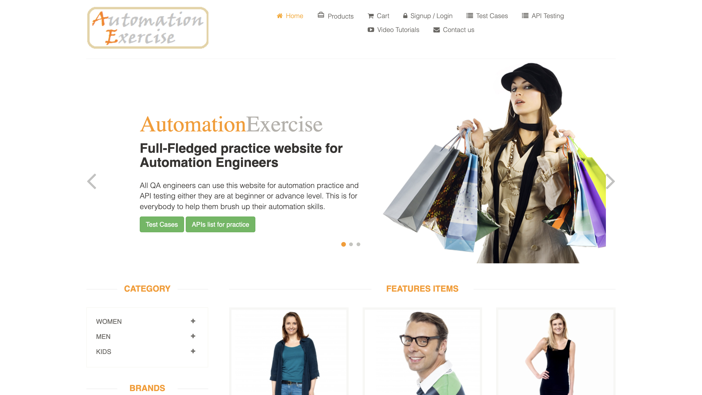

## UI and API Testing Project using the AutomationExercise Test E-commerce Service

> <a target="_blank" href="https://automationexercise.com/">AutomationExercise</a>

### Project features

- Project build in Jenkins
- Execution of UI tests on a remote browser in Selenoid
- Reports with video, screenshot, logs for better debugging
- Comprehensive logging of requests and responses in API tests for better debugging
- Allure reports
- Integration with Allure TestOps
- Integration with Jira
- Test run notifications in Telegram

### List of tests implemented in the project

#### UI

- [x] Login with an existing user account
- [x] Logout from an existing user account
- [x] Creation of a new user account
- [x] Deletion of a user account
- [x] Product search
- [x] Filtering
- [x] End-to-End product purchase

#### API

- [x] Login verification (positive and negative parametrized test)
- [x] Creation of a new user account
- [x] Editing of a user account
- [x] Retrieval of user account information
- [x] Deletion of a user account

### The project is implemented using the following tools:

  <code></code>
  <code></code>
  <code></code>
  <code></code>
  <code></code>
  <code></code>
  <code></code>
  <code></code>
  <code></code>
  <code></code>
  <code></code>
<code></code>

### Automated tests are executed on the Jenkins server
> <a target="_blank" href="https://jenkins.autotests.cloud/job/goldinova_qa_guru_final_work/">Ссылка на проект в Jenkins</a>

### Build parameters

* `ENVIRONMENT` - defines the environment for testing, defaults to STAGE
* `COMMENT` - comment to the build
* `BROWSER_VERSION` - desired version of Google Chrome browser, 100 by default

### To execute automated tests in Jenkins:

1. Open the <a target="_blank" href="https://jenkins.autotests.cloud/job/goldinova_qa_guru_final_work/">project</a>
2. Select the `Build with Parameters` option
3. Choose the environment from the ENVIRONMENT dropdown list
4. Enter a comment in the COMMENT field
5. Specify the browser version in the BROWSER_VERSION field (optional)
6. Press the `Build` button

### Viewing results in Allure Report

Viewing overall test launch results

Viewing test cases with execution report

### Integration with Allure TestOps

Storing all test cases

Dashboard with statistics

Comprehensive information on launches with attachments

### Integration with Jira

Attached test cases and launches

### Integration with Telegram

Sending test run reports to Telegram

### Video report of test execution demonstrating a product purchase

